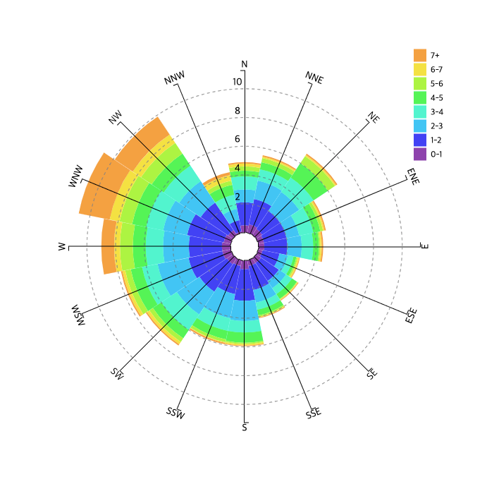

[](https://travis-ci.org/eunchurn/react-windrose-chart) [](https://greenkeeper.io/)

# Windrose Chart Component

[**Storybook**](https://eunchurn.github.io/react-windrose-chart/)

## Features



- [D3js](https://d3js.org/) (JavaScript library for manipulating documents based on data) implemeted SVG Rendering
- Inspired from [ssmaroju](https://bl.ocks.org/ssmaroju)'s [Wind Rose Plot](https://bl.ocks.org/ssmaroju/96af159c1872c2928a972c441bccaf50)

## Installation

```bash
npm i react-windrose-chart
```

## Usage

```javascript
import React from "react";
import styled from "styled-components";
import { WindRose } from "react-windrose-chart";

const Container = styled.div`
  width: 600px;
  height: 600px;
`;

const data = {
  data: [
    {
      angle: "N  ",
      "0-1": 0.5,
      /* ... */
      "6-7": 0.2,
      "7+": 0.1,
      total: 4.9
    } /* ... */
  ],
  columns: [
    "angle",
    "0-1",
    /* ... */
    "6-7",
    "7+"
  ]
};

const App = () => (
  <Container>
    <WindRose data={data.data} columns={data.columns} />
  </Container>
);
```

## Props

|Name|Type|Required|Description|Default|
|:--:|:--:|:-----:|:----------|:------|
|**data**|`Array`|`Required`|Wind Rose Chart data||
|**columns**|`Array`|`Required`|Wind Rose Chart header string array||
|**width**|`Number`|default: `500`|Wind Rose Chart header string array||
|**height**|`Number`|default: `500`|Wind Rose Chart header string array||

### `data` Object array

check [sample data](stories/data.json)

|Name|Type|Required|Description|Default|
|:--:|:--:|:-----:|:----------|:------|
|**0-1**|`Number`|`Required`| Frequency of 0-1 m/sec ||
|**1-2**|`Number`|`Required`| Frequency of 1-2 m/sec ||
|**2-3**|`Number`|`Required`| Frequency of 2-3 m/sec ||
|**3-4**|`Number`|`Required`| Frequency of 3-4 m/sec ||
|**4-5**|`Number`|`Required`| Frequency of 4-5 m/sec ||
|**5-6**|`Number`|`Required`| Frequency of 5-6 m/sec ||
|**6-7**|`Number`|`Required`| Frequency of 6-7 m/sec ||
|**7+**|`Number`|`Required`| Frequency of 7+ m/sec ||
|**angle**|`String`|`Required`| Wind direction `N`, `NNE`, `NE`, `ENE`, `E`, `ESE`, `SE`, `SSE`, `S`, `SSW`, `SW`, `WSW`, `W`, `WNW`, `NW`, `NNW`  ||
|**total**|`Number`|`Required`| Sum of frequencies of this direction ||

### Data utils

- Wind Rose data can be converted by Wind direction(degree) and wind speed data: `{timestamp, direction, speed}` to `{data, columns}`

```javascript
import { caculateWindRose } from "react-windrose-chart";

const data = {
  timestamp: 1523523423,
  direction: [270, 256, 240,...],
  speed: [ 1.02, 0.85, 0.98,...]
}

const windRoseData = calculateWindRose(data);
// Return {data, columns}
```

- Classifying direction function only is as:

```javascript
import { classifyDir } from "react-windrose-chart";

const directionCharacter = classifyDir(270);
// Return : 'W'
```

## Development

### directory & source

- `./src`: wind rose chart component source
- `./dist`: wind rose chart component distribution
- `./stories`: wind rose chart component's storybook source
- `./babel.config.js`: babel configure. (version 7.x)
- `./rollup.config.common.js`: common rollup configuration.
- `./rollup.config.dev.js`: development mode rollup configuration.
- `./rollup.config.prod.js`: production mode rollup configuration.

### scripts

- `yarn storybook`: run storybook component test
- `yarn storybook:build`: storybook build
- `yarn storybook:deploy`: storybook `gh-pages` deploy
- `yarn build`: build the wind rose char component by rollup.
- `yarn build:watch`: build watch mode.
- `yarn dist`: distribution [lerna](https://lerna.js.org) for managing javascript projects with multiple packages.
- `yarn start`: build the wind rose chart component and start storybook with this.
- `yarn test`: testing javasciript code with [jest](https://jestjs.io/) `BABEL_ENV=test`

## License

MIT
